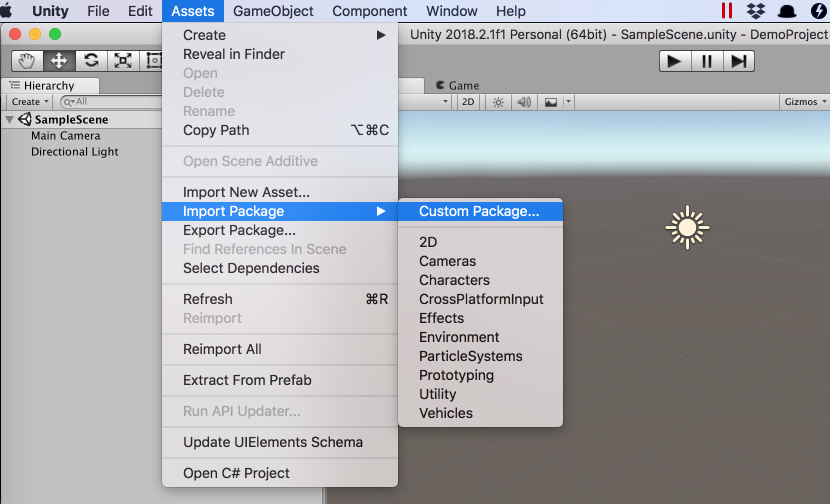
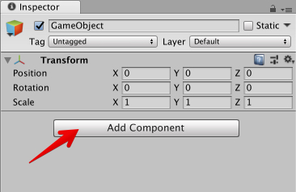

# Backendless SDK for Unity

This is a repository of the Backendless SDK for Unity. It is based on the SDK for .NET. All Backendless APIs available in the .NET build are available in the Unity environment. The SDK has been has been tested with Unity 2018.2.1f1 on Android and iOS. 

##  Installing Backendless SDK in a Unity Project
Backendless SDK for Unity is distributed as a Custom Asset Package. Follow the instructions below for downloading and installing the package into your Unity project:
1. Download a `.unitypackage` file from the [UnityPackage](https://github.com/Backendless/.NET-SDK/tree/master/Projects/BackendlessUnitySDK/UnityPackage) directory in this GitHub repository. The file name includes the version number of the Backendless SDK.
2. Create/Open a Unity project where Backendless SDK should be installed.
3. From the main menu select **Assets** > **Import Package** > **Custom Package...**: 

4. Browse to and select the file from step 1. Click **Open**.
5. Unity displays a confirmation window with the contents of the package: 

6. Click the **Import** button to import the package.
7. Once the package is imported, you can see its contents in the **Project** tab. At this point the Backendless SDK for Unity is installed: 

## Activating Backendless SDK
To start using the Backendless SDK  in your Unity app, the plugin must be "activated". The process is very straight-forward and consists of the following steps:
1. Select a Game Object in the **Hierarchy** tab. This is a Game Object where you will be using the Backendless APIs.
2. Click the **Add Component** button in the **Inspector** tab: 

3. Type in `backendless` in the search bar and select the `Backendless Plugin` component as shown in the image below: 

4. Once added, you will see the following interface for configuring Backendless in the client app: 

5. The **Version** drop-down list has two values to choose from: `Prod` and `Dev`. This lets you configure your client-side to use two different apps on the server-side, one can be used for the development purposes and the other for production. If you have only one app on the server-side, simply pick one (`Prod` or `Dev`) and ignore the other.
6. Depending on the selection in the **Version** drop-down list, enter `App ID` and `API Key` into the corresponding fields. The values can be obtained from the main dashboard of your [Backendless backend](https://develop.backendless.com). For the `API Key` field, you can use `Android`, `iOS` or `Windows` API Keys.

## Running a test script
Backendless package includes a Unity scene configured to run a test script. Follow the instructions below for adding the scene to your project and running the script:
1. Install Backendless SDK in your project per the [instructions above](#install).
2. Locate the **TestDataService** scene in the project assets: 

3. Drag the **TestDataService** scene (not the script) to the **Hierarchy** tab.
4. Select the **BackendlessPlugin** prefab in the scene and set your app's App ID and API Key per the [instructions above](#activate).
5. Run the scene and see in the console an example of how some test data is saved and then retrieved.
6. You confirm the data is saved in your Backendless app by logging in to Backendless Console, switching to the **Data** screen and inspecting the **TestTable** data table.
