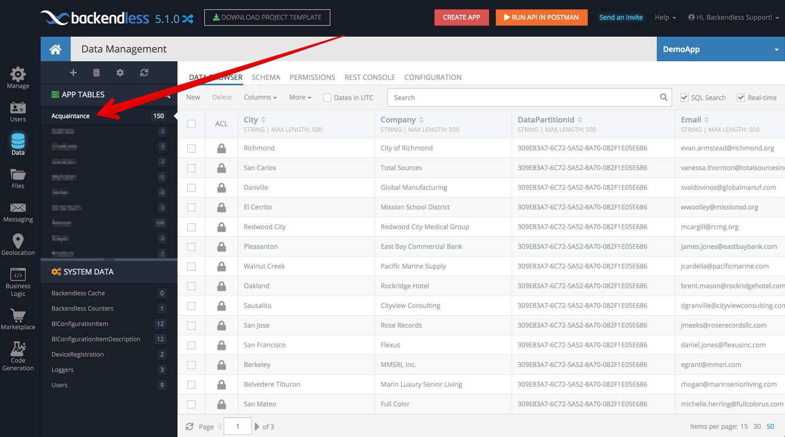

# Acquaint

A simple Xamarin app named *Acquaint*. The app is a simple list of contacts, each of which can be viewed in a detail screen and modified in an edit screen. It runs on iOS 9+ and Android 4.2+. The app uses Backendless to store contact information. The database integration layer is implemented through the `IDataSource` [abstraction](https://github.com/Backendless/.NET-SDK/blob/master/Samples/Acquaint/Common/Acquaint.Abstractions.NetStandard/IDataSource.cs).

## Cross-platform and native
The app is implemented in two ways in order to demonstrate the two different approaches to Xamarin app development:
* Xamarin.Forms cross-platform UI
* Xamarin native, with platform-specific UI implementations

Both implementations are based on .NET Standard 2.0.

## Two platforms
The app targets two platforms:
* iOS
* Android
    
## Backendless backend
To configure the backend for the application:
1. Register and login to your [Backendless application](https://develop.backendless.com)
2. Obtain the `Application ID` and the `.NET API Key` and paste the values into [Settings.cs](https://github.com/Backendless/.NET-SDK/blob/master/Samples/Acquaint/Common/Acquaint.Util.NetStandard/Settings.cs). (you will find the `BackendlessAPPID` and the `BackendlessAPIKey` properties in the code).
3. When the application runs for the first time, it will automatically create a database table called `Acquaintance` and populate it with data:

    
## Integrations
Includes integrations such as:
* getting directions
* making calls
* sending text messages
* email composition

## Requirements
* [Visual Studio __2015__](https://www.visualstudio.com/en-us/products/vs-2015-product-editions.aspx) (14.0 or higher) to compile C# 6 langage features (or Xamarin Studio OS X)
* Xamarin add-ons for Visual Studio (available via the Visual Studio installer)
* __Visual Studio Community Edition is fully supported!__

## Google Maps API key (Android)
For Android, you'll need to obtain a Google Maps API key:
https://developer.xamarin.com/guides/android/platform_features/maps_and_location/maps/obtaining_a_google_maps_api_key/

Insert it in the Android project: `~/Properties/AndroidManifest.xml`:

    <application ...>
      ...
      <meta-data android:name="com.google.android.geo.API_KEY" android:value="GOOGLE_MAPS_API_KEY" />
      ...
    </application>

## Platform-specific UI Features (in native version only)
| 3D Touch Previewing (iOS) | Shared View Transitions (Android) |
| --- | --- |
|  |  |

## Screens

The app has three main screens:
* a list screen
* a read-only detail screen
* an editable detail screen

## People

All images of people in the app come from [UIFaces.com](http://uifaces.com/authorized). In accordance with the guidelines, fictitious names have been provided. 

## Clean and Rebuild
If you see build issues when pulling updates from the repo, try cleaning and rebuilding the solution.

## App Authors
The original implementation of the app is available in the [XamarinHQ github repository](https://github.com/xamarinhq/app-acquaint). Our implementation has been updated to build with .NET Standard and replaced the Azure Mobile Backend with Backendless (which we believe made the code much cleaner :wink: )